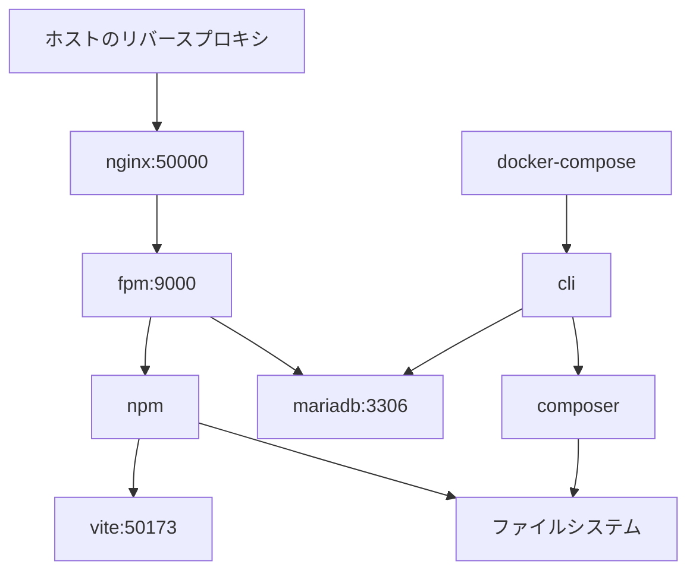

# laravel-docker-vite

`docker compose` + `Vite` の環境構築サンプルです。

デモとして以下の環境を採用しています。

* Laravel 12
* Inertia
* Vue.js

## 全体像

以下のサブドメインを実装しています。

### `env-sample.nazki0325.net`
中核となるドメイン。

### `v1.env-sample.nazki0325.net`, `v2.env-sample.nazki0325.net` 
PHP + Vite が動作するサブドメイン。`npm run dev` と `npm run build` の双方に対応。

### `static.env-sample.nazki0325.net`
静的ファイルだけのサブドメイン。

## Docker コンテナの構造

## 構築手順

1. [Docker の最低限のセットアップ](docs/01-initial-setup.md)
1. [nginx と fpm の設定](docs/02-nginx-fpm.md)
1. [mariadb の設定](docs/03-mariadb.md)
1. [vite の設定](docs/04-vite.md)
1. [SSL の設定](docs/05-ssl.md)
1. [サブドメインの設定](docs/06-subdomains.md)
1. [その他、細かい調整](docs/07-env.md)
