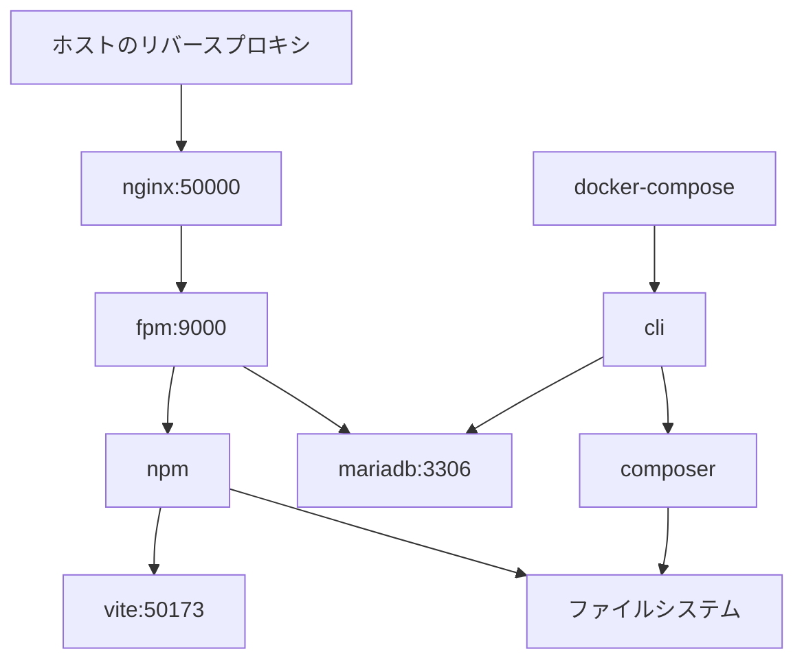

# 全体の構造

```mermaid
flowchart TD
    ホストのリバースプロキシ --> nginx:50000 --> fpm:9000 --> npm --> vite:50173
    docker-compose --> cli --> mariadb:3306
    cli --> composer
    fpm:9000 --> mariadb:3306

    composer --> ファイルシステム
    npm --> ファイルシステム
```
